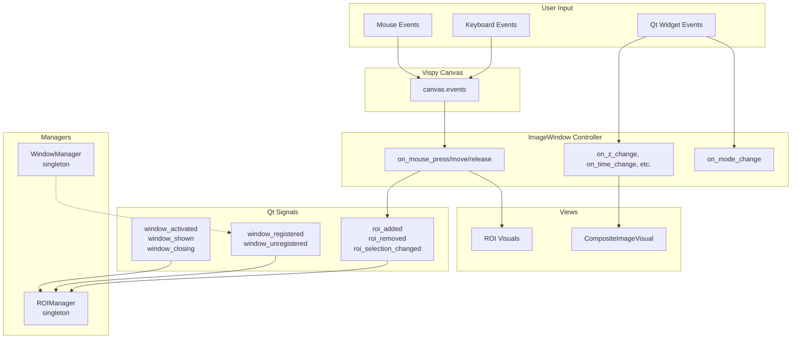

# CLAUDE.md - AI Assistant Guide for pyvistra

## Project Purpose

**pyvistra** provides a quick and painless way to view multi-dimensional microscopy images and work with ROIs (Regions of Interest). The library prioritizes simplicity and usability over feature bloat.

## Design Principles

### Keep It Simple (KISS)
- Favor the simplest solution that works
- Avoid premature abstraction - three similar lines are better than a premature helper
- Don't add features beyond what was explicitly requested
- Delete unused code completely; no backwards-compatibility shims

### Separation of Concerns (MVC-inspired)
- **Model**: Data proxies (`io.py`), ROI geometry (`rois.py`)
- **View**: Vispy visuals (`visuals.py`), Qt widgets (`widgets.py`, `ui.py`)
- **Controller**: Event handlers in `ui.py`, managers (`manager.py`, `roi_manager.py`)

Keep data structures separate from algorithms. A class should either hold data OR perform operations, rarely both.

## Architecture

### Data Model: 5D Convention

All image data is normalized to `(T, Z, C, Y, X)`:
- **T**: Time points
- **Z**: Depth slices
- **C**: Channels
- **Y, X**: Spatial dimensions

This eliminates dimension confusion. Use `load_image()` which returns `(proxy, metadata)`.

### Lazy Loading with Proxies

Proxies behave like numpy arrays but load data on-demand:
- `Imaris5DProxy` - HDF5-based .ims files
- `Numpy5DProxy` - In-memory arrays
- `TransposedProxy` - On-the-fly reorientation

```python
data, meta = load_image("large_file.ims")  # data is a proxy
slice_2d = data[0, 5, 1, :, :]  # loads only this slice from disk
```

### Event System



**Key flows:**
1. **Mouse interaction**: Vispy canvas captures mouse → `ImageWindow` handlers → ROI creation/modification → signals to `ROIManager`
2. **Slider changes**: Qt widget signals → handler updates `CompositeImageVisual`
3. **Window lifecycle**: `WindowManager` emits signals → `ROIManager` updates its window list

### ROI System

ROIs follow a distributed storage pattern:
- Each `ImageWindow` owns its `rois` list (Model)
- `ROI` subclasses define geometry and visuals (View + data)
- `ROIManager` provides centralized UI and cross-window operations (Controller)

Serialization uses JSON: `{"type": "RectangleROI", "name": "...", "data": {...}}`

## Module Responsibilities

| Module | Responsibility |
|--------|---------------|
| `io.py` | Data loading, 5D normalization, proxy classes |
| `imaris_reader.py` | HDF5 parser for Imaris .ims files |
| `ui.py` | `ImageWindow`, `Toolbar`, event handling |
| `visuals.py` | `CompositeImageVisual` for GPU rendering |
| `rois.py` | ROI base class and concrete types |
| `roi_manager.py` | ROI list UI, save/load, analysis integration |
| `widgets.py` | `HistogramWidget`, `ContrastDialog` |
| `manager.py` | `WindowManager` singleton |
| `ortho.py` | `OrthoViewer` for 3-panel orthogonal views |
| `analysis.py` | ROI-based measurements with `@magicgui` |

## Development Guidelines

### Before Making Changes
1. Read the relevant module(s) first
2. Understand existing patterns before adding code
3. Check if the functionality already exists

### When Implementing
- Modify existing files; avoid creating new ones unless necessary
- Keep changes minimal and focused on the request
- Don't add error handling for impossible scenarios
- Don't add docstrings/comments to code you didn't change
- Trust internal code and framework guarantees

### Coordinate Systems
- Vispy uses OpenGL coordinates (bottom-left origin)
- Images use numpy indexing (top-left origin)
- Use `_map_event_to_image()` for mouse-to-data coordinate conversion

### ROI Manager Synchronization
After modifying `window.rois`, emit the appropriate signal:
```python
self.rois.append(new_roi)
self.roi_added.emit(new_roi)
```

## Common Patterns

### Adding a New ROI Type
1. Create class in `rois.py` inheriting from `ROI`
2. Implement: `update()`, `hit_test()`, `move()`, `adjust()`, `to_dict()`, `_update_visuals_from_data()`
3. Register tool button in `Toolbar.__init__`

### Adding File Format Support
1. Create reader class (follow `ImarisReader` pattern)
2. Add proxy class in `io.py` if lazy loading needed
3. Update `load_image()` with extension detection
4. Ensure output is 5D `(T, Z, C, Y, X)`

### Adding Analysis Functions
1. Create function in `analysis.py` with `@magicgui` decorator
2. Register in `ROIManager.create_analysis_menu()`

## Critical Gotchas

| Issue | Solution |
|-------|----------|
| Wrong dimension order | Always use `(T, Z, C, Y, X)` after `load_image()` |
| Proxy slicing loads into RAM | Be aware when slicing large regions |
| Mouse coords don't match data | Use `_map_event_to_image()` |
| ROI Manager out of sync | Emit signals after modifying `window.rois` |
| Multiple Qt event loops | Only call `app.exec_()` once |
| HDF5 file handle leaks | Close reader when done |

---

*Last Updated: 2025-12-24*
